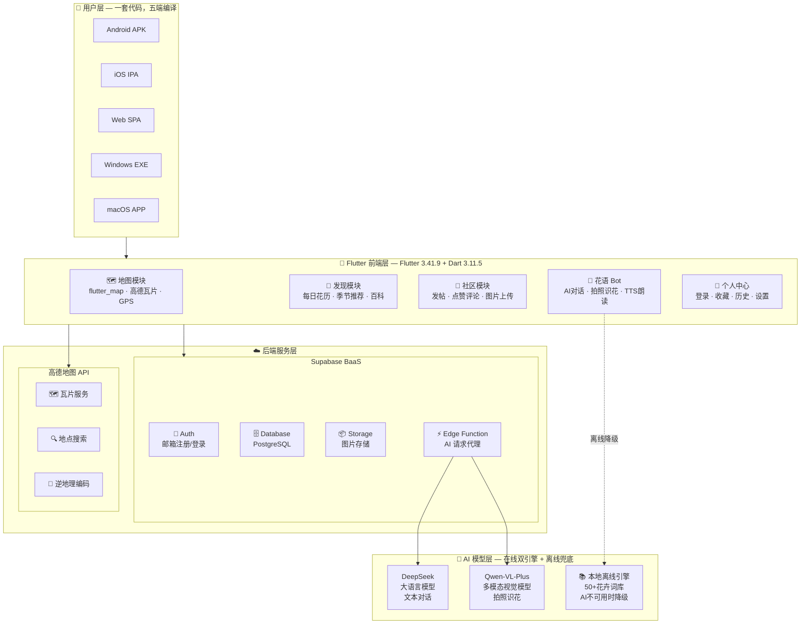
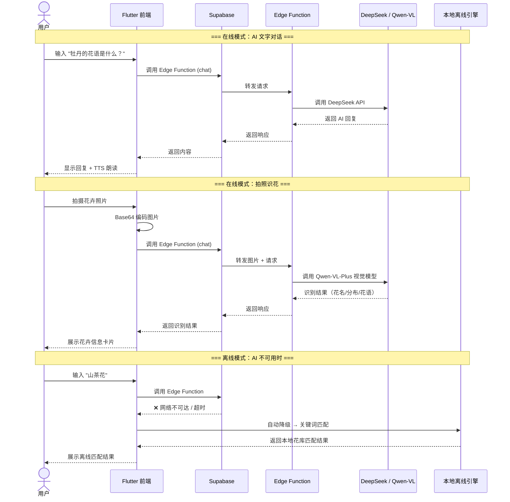
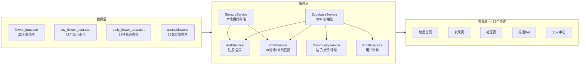
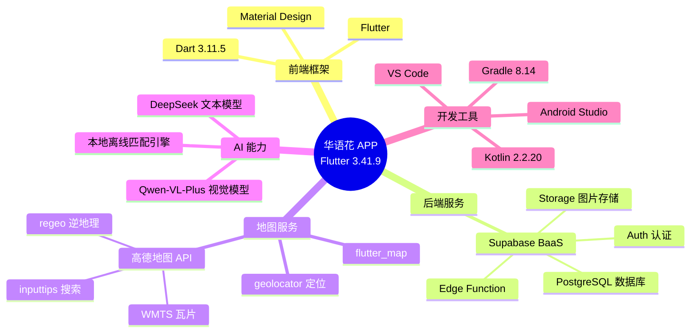

# 华语花 APP — 系统架构图 (Mermaid)

以下 Mermaid 代码可在 **GitHub**、**VS Code**（安装 Mermaid 插件）、**语雀**、**Notion** 中直接渲染为图表。

## 1. 系统架构总览 (Block Diagram)

## 2. 数据流图 (Sequence Diagram)

## 3. 模块依赖关系图

## 4. 技术栈总览

